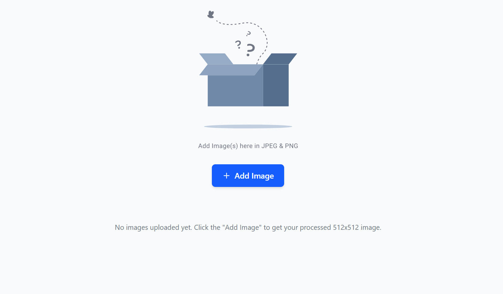
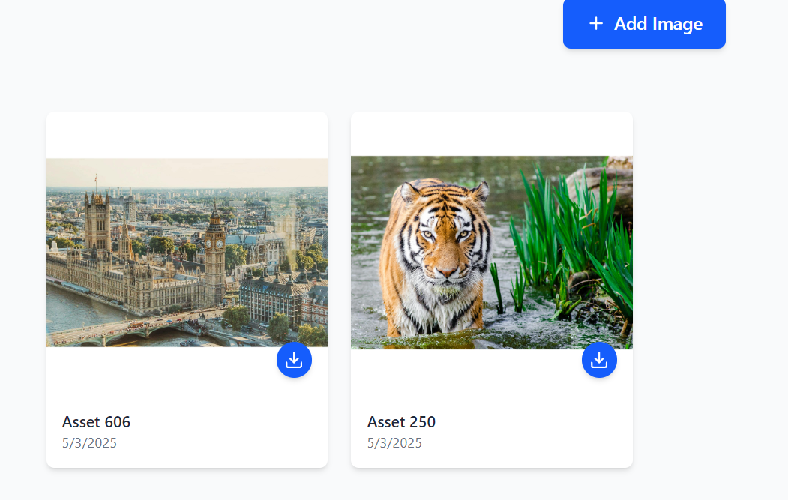

# Team-siksha Assignment (Frontend) 

I Made the image parser which converts the image into 512x512 size

Tech stack used - React, Tailwind css
### This is the Home Page 

 

 You can add the images in png, jpg, jpeg extension

For some reason .tif images are not working

Used Context Api for managing the state of the images

### These are the uploaded and processed images you user can download
